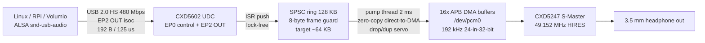

# Spresense 192 kHz / 24-bit Hi-Res USB-DAC (UAC2)

[](LICENSE)
[](https://nuttx.apache.org/)
[](https://www.usb.org/)
[]()

Turn a **Sony Spresense** (CXD5602 + CXD5247) into a **dedicated 192 kHz / 24-bit USB Audio Class 2.0 (UAC2) hi-res USB-DAC** — with a from-scratch NuttX device driver, native 192 kHz S-Master bring-up, multi-tier clock-drift servo, zero-copy direct DMA engine, and a transparent direct-to-DAC audio pipeline.

**Status: Rev76, verified working.** Continuous playback at 100% volume with zero distortion. Direct 24-bit MSB-aligned stream (zero software DSP), single-copy direct-to-DMA, async descriptors with live PI telemetry, and rock-solid ~70 KB buffer landing.

---

## Key Features

- **192 kHz Native S-Master** — Clean HIRES power-cycle bring-up sequence (`power-off -> set_clkmode(HIRES) -> power-on`), eliminating hot-switch mute permanently.
- **Multi-Tier Clock-Drift Servo** — Absorbs crystal drift between host and device; ring buffer level smoothly lands at ~64–70 KB (of 128 KB) and stays bounded indefinitely.
- **Direct MSB-Aligned Passthrough** — Host 24-in-32-bit audio is passed untouched to the DAC without software scaling or DSP (proven from live USB logs, lower byte always `0x00`). No digital attenuation or artificial shifts.
- **Zero-Copy Direct-to-DMA** — Intermediate chunk buffer eliminated; ring buffer feeds APB DMA buffers directly (`memcpy` calls in pump thread = 0, 8-byte history inlined as `ldmia/stmia`, 76-byte stack frame — verified by disassembly).
- **8-Byte Frame-Boundary Guard** — SPSC ring buffer strictly enforces 8-byte alignment (`len = avail & ~7u`), preventing stereo phase tear even under extreme buffer conditions.
- **Async UAC2 Descriptors & Live PI Telemetry (Rev76)** — Standard UAC2 Async descriptors (`0x05` + `bSynchAddress = 0x81`) with EP1 configured; integer PI controller runs live in background calculating nominal frequency convergence (`0x00180000`).
- **Linux / Raspberry Pi / Volumio Ready** — Single-Alt-0 streaming architecture tailored to CXD5602 silicon capabilities (see Limitations).

---

## Architecture & Pipeline



### Firmware Internals
- **Always-Feed Pump**: The audio engine is never starved; underrun prevention is structurally guaranteed.
- **Two-Tier Ring Reserve**: Dampens host USB scheduling jitter while maintaining low audio latency.
- **Guarded Retry-Restart**: Recovers seamlessly from unexpected stream interrupts without hanging.
- **TRM-Defined ERR Tolerance**: Aligned with Sony CXD5602 Hardware Reference Manual specifications.
- **Demoted USB Interrupts**: USB IRQs are demoted below audio DMA priority, eliminating audio dropouts during heavy USB traffic.

---

## Hardware Requirements

- **Sony Spresense Main Board** + **Extension Board**
- Micro-USB cable connected to the **Extension Board USB port** for audio streaming
- UART serial connection (115200 bps) for real-time diagnostic logs (e.g. `COM6` on Windows / `/dev/ttyUSB0` on Linux)
- Linux host for playback (PC, Raspberry Pi, Volumio, Android, etc.)

---

## How to Build & Flash

Prerequisites: Spresense SDK (`nuttx/` + `sdk/`), ARM GCC (`spresense-tools`), Ubuntu/WSL environment.

```bash
# Optional: Set paths if different from defaults ($HOME/spresense, $HOME/spresense-tools)
export SPRESENSE=/path/to/spresense
export SPRESENSE_TOOLS=/path/to/spresense-tools

# Build and flash to target board
./build_and_flash.sh <serial-port>   # or set UAC2_FLASH_PORT
# Example Windows: ./build_and_flash.sh COM6
# Example Linux:   ./build_and_flash.sh /dev/ttyUSB0
```

`nuttx.spk` is generated under `sdk/` and flashed automatically.

To record real-time serial logs:
```bash
python tools/record_serial.py 15 test_logs/spresense_serial.log
```

---

## Technical Insights (Evolution: Rev68 – Rev76)

| Rev | Problem / Challenge | Root Cause | Engineering Solution |
| :---: | :--- | :--- | :--- |
| **68** | DAC stayed muted at 192 kHz | S-Master hardware mutes on hot clock-switch while powered | Power-cycle bring-up: `power-off -> set_clkmode(HIRES) -> power-on` |
| **73** | Audio collapsed after minutes; volume change "fixed" it | Crystal clock drift filled 128 KB buffer; overrun write tore 8-byte frame boundary | `len = avail & ~7u` frame guard + multi-tier proportional drop servo (~64 KB landing) |
| **74** | Harsh clipping unless volume reduced to ~10% | Erroneous `<< 8` shift (+48 dB, top-byte wrap) applied to already MSB-aligned data | Shift removed; direct MSB-aligned passthrough (zero DSP / zero shift) |
| **75** | Bus switching noise (audiophile optimization) | Double memory copy via 2048 B staging buffer + per-buffer audit scan | Single-copy ring-to-APB, audit loop bypassed; disassembly-verified |
| **76** | Asynchronous explicit feedback exploration | UAC2 Async descriptor integration & host adaptive tracking | Full async descriptors (`0x05` + `0x81`) + EP1 configured; live Q16.16 PI telemetry |

### Packet & Stream Math
- **Sample rate ($F_s$)**: 192,000 Hz
- **Bytes per frame**: 2 ch × 4 bytes (32-bit slot) = 8 bytes
- **Total bit rate**: 192,000 × 8 × 8 = 12.288 Mbps
- **High-Speed microframe period**: 125 µs (8,000 / sec)
- **Samples per microframe**: 192,000 / 8,000 = 24 samples/µframe
- **Payload per microframe**: 24 × 8 = 192 bytes
- **wMaxPacketSize**: 200 bytes (+1 sample drift headroom)

---

## Verification & Logs

- `test_logs/spresense_serial.log` — Raw boot + 15s streaming logs confirming:
  - `STREAMING (192kHz Active)`
  - `aud_udr:0`, `rst:0`, `dup:0`, `gap:0`, `erronly:0`, `EOGAP all 0`
  - `Over:22756` (overrun count completely halted)
  - `raw == dst` direct MSB-aligned passthrough samples (zero shift)
  - Live PI telemetry (`fb:0x0017e957`, `ferr:-6820`)
- `spresense_192k24b_1khz.wav` — 1 kHz reference test tone (192 kHz / S32 / stereo).
- `tools/` — Serial recorder, audio tone generator, WinUSB PoC.

---

## Limitations

- **Windows stock driver (`usbaudio2.sys`)**: Requires Alt > 0 for audio streaming, but the CXD5602 UDC hardware autonomously STALLs Alt > 0 requests (silicon-level constraint). Linux ALSA fully supports single-Alt-0 streaming. A WinUSB user-mode streaming PoC is located in `tools/win_poc/`.
- **Async Closed-Loop Feedback**: Async descriptors and live PI telemetry are active; actual ISO IN feedback packet submission is guarded (`UAC2_FB_HW_ENABLE >= 2`) due to CXD5602 DCD ISO IN controller limitations. Clock drift is reliably absorbed by the Rev73 servo.

---

## Directory Layout

- `include/` — UAC2 specification definitions, descriptor structures, ring buffer
- `src/` — UAC2 device driver, descriptors, DMA bridge, application main
- `docs/` — Technical engineering notes, resume/reboot history logs
- `tools/` — Verification scripts, test tone generators, `win_poc/` transfer PoC
- `test_logs/` — Raw USB and serial verification evidence logs

---

## License

Apache License 2.0 (see [LICENSE](LICENSE)). Spresense SDK modifications are distributed as documented source procedures; the SDK tree itself is not redistributed.
